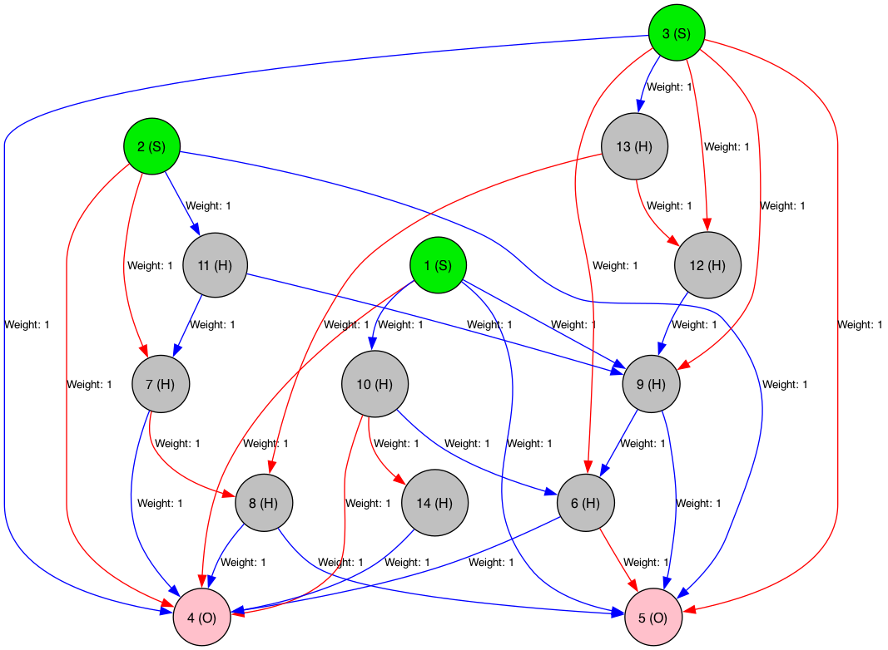

# NEAT++

## Example of NEAT network

## General coding style guide

1. Please, use 8 SPACE indentation

2. Please, try to be consistent with other code in the codebase (including formatting and naming conventions and more!)

## Useful docker commands

#### Build image and start container
Build image: `docker build -t ubuntu .`

Run image and start Container: `docker run -it --name ubuntu ubuntu /bin/bash`

#### Start container
Start, stop, and restart container: `docker container <start:restart:stop> ubuntu`

#### Open container shell
Open container command-line: `docker exec -it ubuntu /bin/bash`

## Build the project

* `mkdir build`

* `cd build`

* `cmake ..` (make sure you've added CMake binary to your path!)

* `make`

* `./neat`
